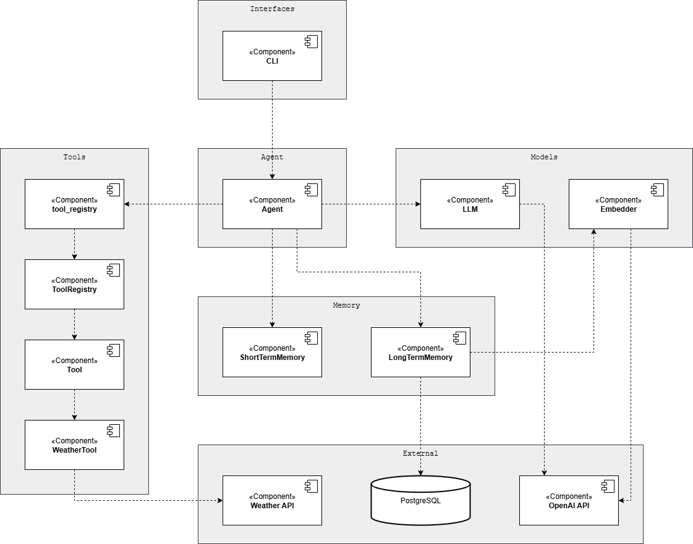

# Personal Assistant AI Agent

## Progress:
### Stage 1 - Prototype - 01/10/2025:
- Current AI agent:
  - LLM: OpenAI API
  - Embedder: OpenAI API
  - Short-term memory
  - Long-term memory: PostgreSQL + pgvector
  - 1 tool: weather
  - Running through CLI

---

## Reference
1. Anthropic. (2024, December 19). Building effective AI agents. Building Effective AI Agents \ Anthropic. https://www.anthropic.com/engineering/building-effective-agents
